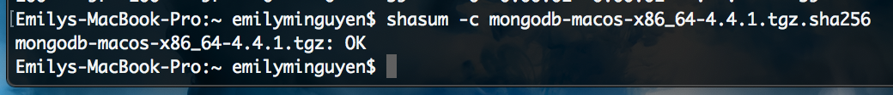
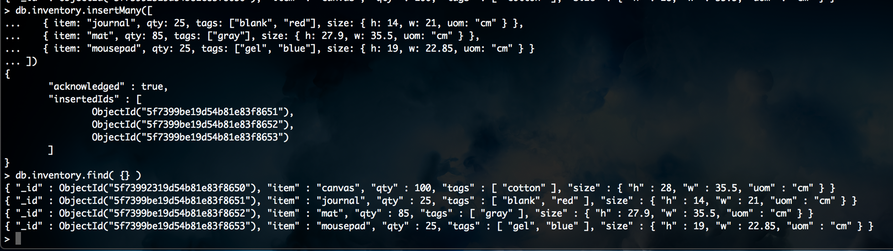
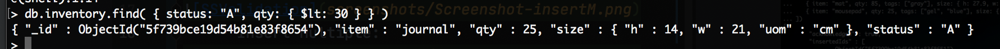
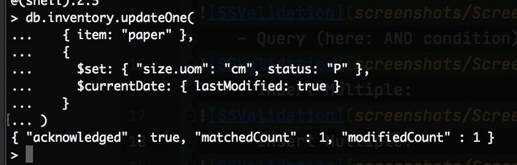
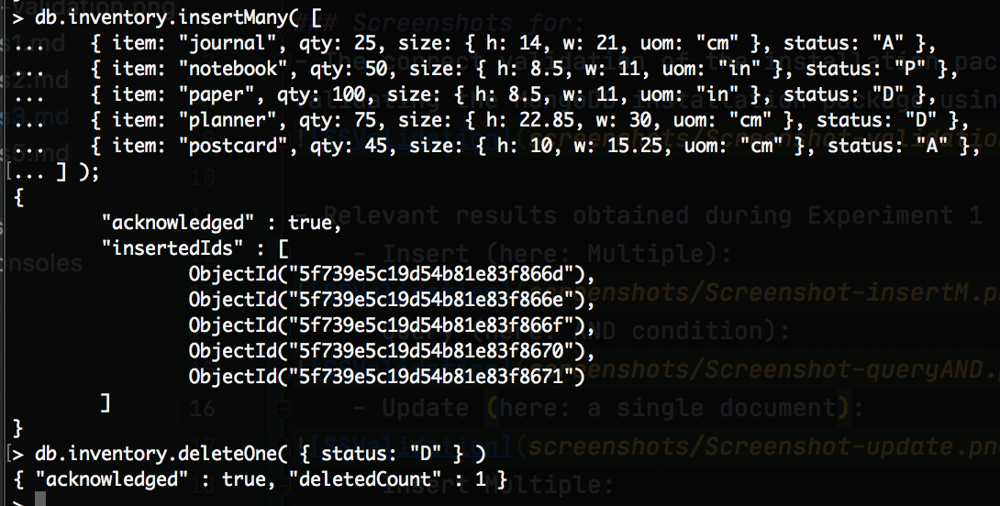
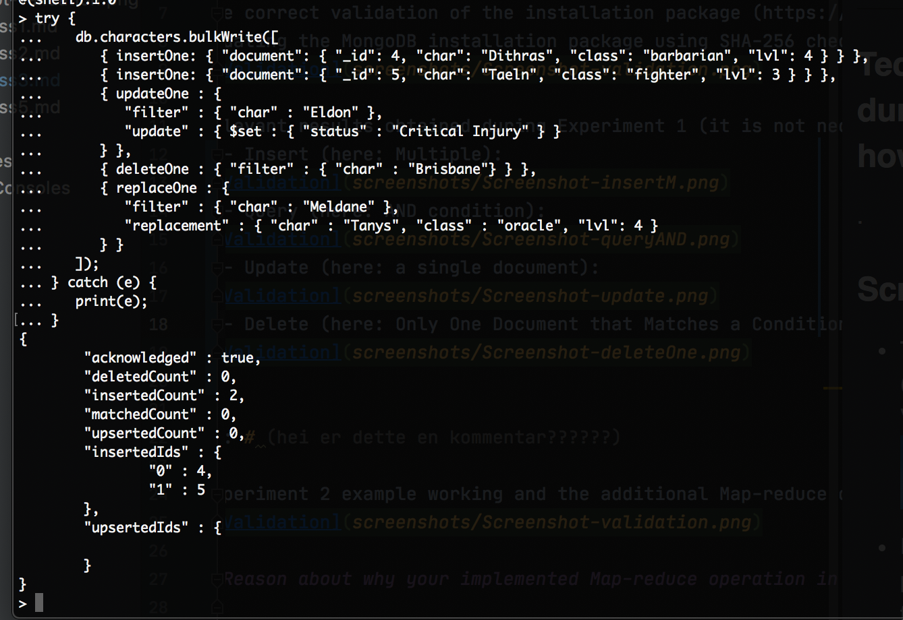

# DAT250: Software Technology Experiment Assignment 3

### Technical problems that you encountered during installation and use of MongoDB and how you resolved
.

### Screenshots for:
- The correct validation of the installation package (https://docs.mongodb.com/manual/tutorial/verify-mongodb-packages/):  
Validating the MongoDB installation package using SHA-256 checksum  

- Relevant results obtained during Experiment 1 (it is not necessary to put a single screenshot on each substep, but at least one significant from each CRUD operation):  
    - Insert (here: Multiple):

    - Query (here: AND condition):

    - Update (here: a single document):

    - Delete (here: Only One Document that Matches a Condition):

    - BulkWrite() (here: performs multiple operations on the collection):

[//]: # (hei er dette en kommentar??????)

- Experiment 2 example working and the additional Map-reduce operation (and its result) developed by each of you:  

### Reason about why your implemented Map-reduce operation in Experiment 2 is useful and interpret the collection obtained.
.

### Any pending issues with this assignment which you did not manage to solve
.
